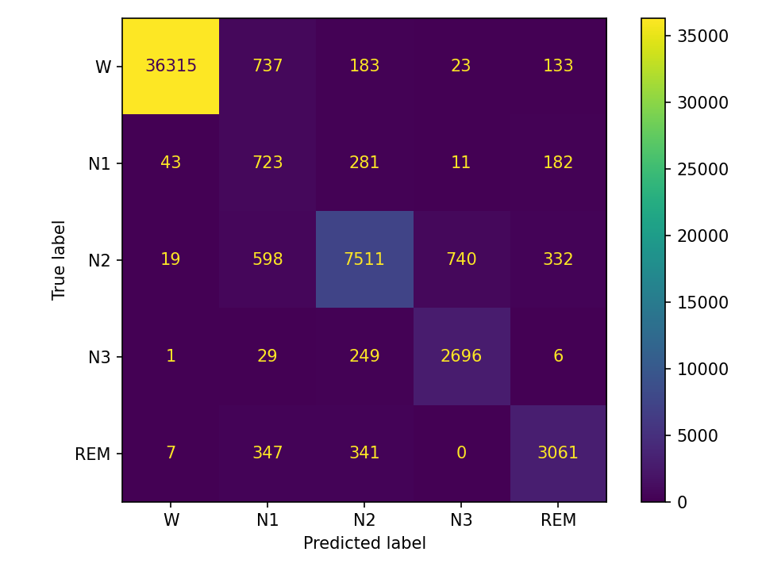

# EEG Sleep Staging (Sleep-EDF)

Two-channel sleep stage classifier on Sleep-EDF (Fpz-Cz, Pz-Oz).

Preprocessing → small CNN stem → 1× Transformer encoder → HMM (Viterbi) smoothing. Subject-wise 5-fold CV so we don’t leak subjects across splits.

I wanted a compact, reproducible EEG project that shows I can go end-to-end (data → model → eval) and talk about the trade-offs like an adult: subject-wise CV, macro-F1/κ (not just accuracy), and where the model actually fails (N1/REM).

TL;DR results

    5-fold subject-wise CV (0.3–40 Hz, 30-s epochs):
    Accuracy: 92.4 ± 1.9% Macro-F1: 79.0 ± 4.0 Cohen’s κ: 0.85 ± 0.04

    HMM smoothing mainly reduces spurious flips; small lift on N1/REM.
    
## Confusion matrix

Artifacts land in artifacts/:

metrics_cv.json (summary + per-class precision/recall/F1)

confusion_cv.png (aggregated over folds)

splits/fold*.json (saved train/val/test subject splits for reproducibility)

# Data

    Sleep-EDF (PhysioNet). I use MNE’s dataset helper, so you don’t need to manually download anything. First run will cache data under ~/mne_data/.

    Preprocessing: pick EEG Fpz-Cz and EEG Pz-Oz, band-pass 0.3–40 Hz, epoch into 30 s windows via hypnogram annotations, per-epoch z-score, downsample to 50 Hz.

    Model: small 1D-CNN stem (downsamples ~8×), project to d-model, add positional encoding, 1 Transformer encoder layer, global average, linear head (5 classes: W/N1/N2/N3/REM). Class-weighted loss to deal with imbalance.

    Smoothing: HMM/Viterbi over epoch-level softmax (α_stay = 0.88) to reduce single-epoch label jumps.

    Evaluation: subject-wise 5-fold CV. I carve a tiny validation set from the training subjects per fold (so test subjects remain unseen). I report acc, macro-F1, and κ. Splits are saved.

# To Start:

    # 1) clone
    git clone https://github.com/<your_user>/EEG_sleep_stage_classifier.git
    cd EEG_sleep_stage_classifier

    # 2) env (conda) – Python 3.10
    conda create -n eeg python=3.10 -y
    conda activate eeg
    pip install -r requirements.txt
    # if you don’t want a reqs file:
    # pip install mne torch torchvision torchaudio scikit-learn numpy pandas matplotlib

    # 3) run
    # Open the notebook and "Run All" - Make sure to set CV to True and Proof of Concept (POC) to False.
    #    notebooks/EEG_sleep_staging.ipynb

    Outputs will appear under artifacts/.

# What’s missing / next steps

    N1/REM are still the weakest classes (as usual with EEG-only). Probably can add EOG/EMG, or have longer context (stack a few epochs), or a cost-sensitive loss (try first).

    Replace the heuristic HMM with a learned transition matrix from train hypnograms (Need to read more about this).

    Small architecture tweaks: 2–3 encoder layers and a little token-dropout usually add a point or two on macro-F1. (Bigger change seen in other papers, need to understand better)

# Repo layout

    EEG_sleep_stage_classifier/
    ├── artifacts/
    │   ├── metrics_cv.json
    │   ├── confusion_cv.png
    │   └── splits/
    │       ├── fold1.json
    │       ├── fold2.json
    │       ├── fold3.json
    │       ├── fold4.json
    │       └── fold5.json
    ├── EEG_sleep_stage_classifier.ipynb
    ├── requirements.txt
    └── README.md

